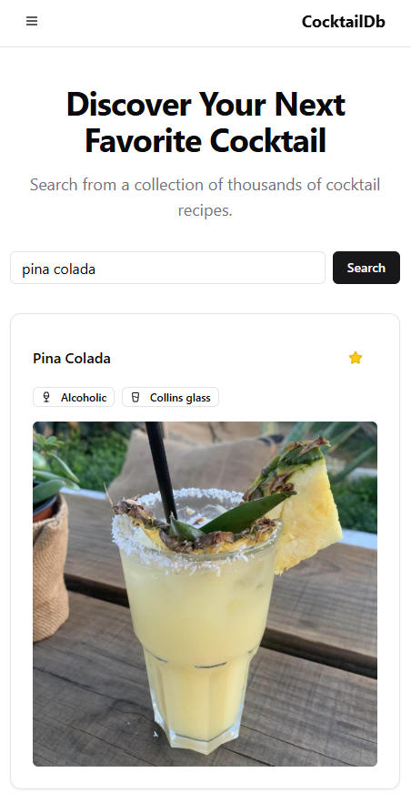

# Fast Cocktails



Fast Cocktails is a modern, responsive web application for discovering, viewing, and saving your favorite cocktail recipes. The project was built using Vue.js, TypeScript, and Pinia, with a focus on a clean and intuitive user interface powered by Tailwind CSS and `shadcn-vue`.

For the reference, it was built in less than 1 hour.

## The Idea: A "Vibe Coding" Experiment

This project was created as an experiment to answer a core question: **How fast can a developer build a functional MVP by combining their existing knowledge with real-time AI collaboration?**

> The goal was to test the speed of development by "vibe coding" — a rapid, iterative process where a developer's expertise in JavaScript, frontend, and Vue is augmented by an AI assistant to handle boilerplate, troubleshoot issues, and generate component code, allowing the developer to focus purely on logic and features.

The entire application, from initial setup and configuration to building complex UI components and state management, was developed through a dynamic conversation, proving the viability of AI-assisted coding for rapid prototyping.

## Core Features

- **Cocktail Search**: Instantly search thousands of recipes from TheCocktailDB API.
- **Detailed Recipes**: View a clean, detailed recipe for any cocktail, including ingredients and step-by-step instructions.
- **Dual-Unit Measurements**: Ingredient quantities are automatically displayed in both ounces (oz) and milliliters (ml) for international users.
- **Favorites System**: Save your favorite cocktails. All selections are persisted in the browser's local storage.
- **Client-Side Search**: Quickly filter through your saved favorites without making extra API calls.
- **Responsive Design**: A modern, mobile-first interface that looks great on any device.

## Tech Stack

- **Framework**: Vue.js 3 (with Composition API and `<script setup>`)
- **Build Tool**: Vite
- **Language**: TypeScript
- **State Management**: Pinia
- **Styling**: Tailwind CSS
- **Component Library**: `shadcn-vue`
- **Icons**: `lucide-vue-next`

## Project Structure

The project follows a standard and scalable Vue.js architecture, organized as follows:

- **`fast-cocktails/`** (Root directory)
  - **`public/`**: Contains static assets that are copied directly to the build output.
  - **`src/`**: The main application source code.
    - **`assets/`**: Holds global stylesheets like `style.css`.
    - **`components/`**: Contains reusable Vue components.
      - `layout/`: For structural components like the `Navbar`.
      - `ui/`: For `shadcn-vue` components (Button, Card, etc.).
    - **`router/`**: Defines the application's routes (`/` and `/favorites`).
    - **`stores/`**: Contains Pinia state management modules (`cocktailStore`, `favoritesStore`).
    - **`views/`**: Contains page-level components (`HomeView`, `FavoritesView`).
    - `App.vue`: The root Vue component.
    - `main.ts`: The application's entry point where Vue and plugins are initialized.
  - `index.html`: The main HTML file for the application.
  - `package.json`: Lists project dependencies and scripts.
  - `postcss.config.js`: Configuration for PostCSS.
  - `tailwind.config.js`: Configuration for Tailwind CSS.
  - `vite.config.ts`: Configuration for the Vite build tool.

## Getting Started

Follow these instructions to get a local copy of the project up and running.

### Prerequisites

Make sure you have Node.js and npm installed on your machine.

- [Node.js](https://nodejs.org/) (which includes npm)

### Installation

1.  **Clone the repository:**

    ```
    git clone https://github.com/kresohr/vibe-coding-cocktails.git
    cd fast-cocktails
    ```

2.  **Install the dependencies:**
    This command will install all the necessary packages defined in `package.json`, including Vue, Pinia, and Tailwind CSS.
    ```
    npm install
    ```

### Running the Development Server

Once the installation is complete, you can run the application in development mode.

    npm run dev

This will start the Vite development server, and you can view the application by navigating to the local URL provided in your terminal (usually `http://localhost:5173`). The server supports Hot Module Replacement (HMR), so most changes you make to the code will be reflected in the browser instantly without a full page reload.
